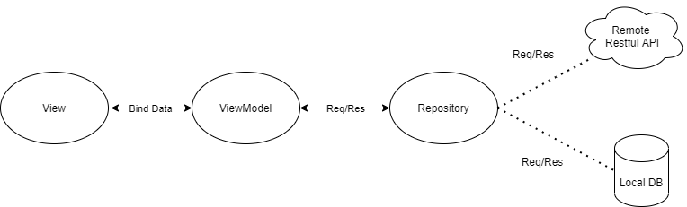

# E-Book
E-Book is an android application that allows user to view the book information along with title, description, author, published date and comments from other users. Moreover, user can also view the top books which are borrowed mostly.

# App Architecture
The application was used MVVM Pattern the is a comment useful for developer easy to maintenance and update source code. It is come from the word Model, View and ViewModel.
- View: Represents classes for display any view (user interface) on the screen such as Activity, Fragment, Widget, Adapter, Dialog etc.
- Model: Represents the data which request or response from API or in a local database (entity).
- ViewModel: Represents classes for binding data from repository to view, handling any request from views to repository, and any other operations and logics.

As we can see a repository which handles the request/response the data from API or Local Database. It is a comment usage from many developers to handle business logic, it is worked closely to data access layer that is more clearly and separately to make developer easier manages a source code. Sometime we can handle a logic to operate the data between API and local database together before response to viewmodel.

# Project Structure
- di: contains any class for dependency injection such as ui module(activity/fragment), network module(Api Service/Repository/ViewModel).
- helper: contains any helper class to use anywhere in the project to be reusable.
- utility: contains any utility classes to use anywhere in the project.
- listener: contains any callback/listener interface to use anywhere in the project.
- model: contains any class data which maps to the entity in local database or for request/response from API.
- view: contains any class for display view (user interface) on the screen such as Activity, Fragment, Widget, Adapter, Dialog etc.
- viewmodel: contains any class for binding data from repository to view or handling a request from view to repository.
- repository: contains any class for handling a business logic to request/response the data from API or Local database to viewmodel.
